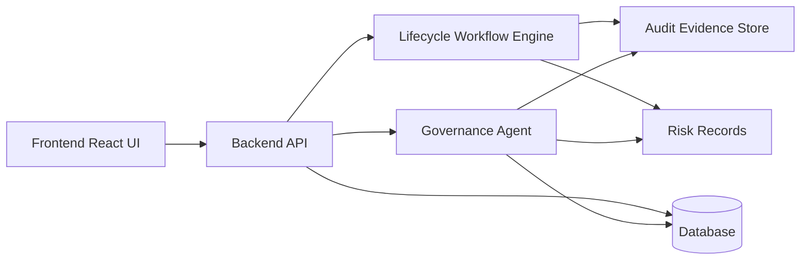

# Architecture

This document describes the local portfolio architecture for the **Employee Lifecycle Automation & Governance Agent**.

## High-level architecture diagram

## Component overview

### Frontend React UI
- Presents lifecycle dashboards and role-based views for Admin, HR, IT, Security, and GRC users.
- Supports local demo interactions for onboarding, transfers, and offboarding governance.

### Backend API
- Central service layer for authentication, workflow endpoints, and governance data retrieval.
- Coordinates requests between UI, workflow processing, governance agent logic, and data stores.

### Lifecycle Workflow Engine
- Models lifecycle workflow states and transition logic for onboarding, transfer, and offboarding processes.
- Tracks progress through request, approval, provisioning, review, evidence, and closure stages.

### Governance Agent
- Demo/local assistant that summarizes lifecycle status, evidence gaps, and access risk posture.
- Produces role-specific governance summaries for audit and operational review.

### Database
- Persistent store for users, employees, workflows, tasks, and governance metadata.
- Provides structured source records used by dashboards and governance summaries.

### Audit Evidence Store
- Stores lifecycle evidence metadata (e.g., approver traceability, completion artifacts, timestamps).
- Supports audit-oriented review and completeness checks in demo workflows.

### Risk Records
- Captures modeled access risk signals tied to lifecycle events.
- Enables risk-aware governance review for onboarding, transfers, and offboarding.

## Notes
- This architecture is intentionally local and demo-focused.
- All records are synthetic demo data.
- No production HRIS, IAM, ticketing, SIEM, SOAR, or enterprise GRC integrations are enabled.
